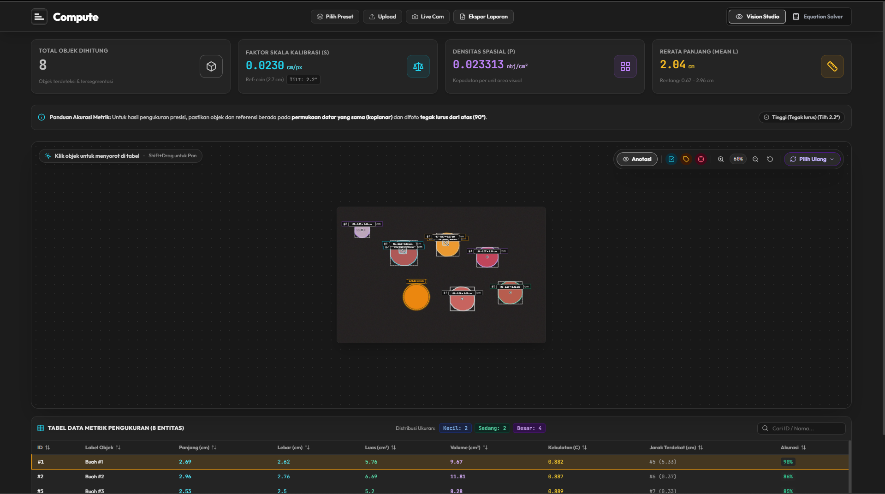
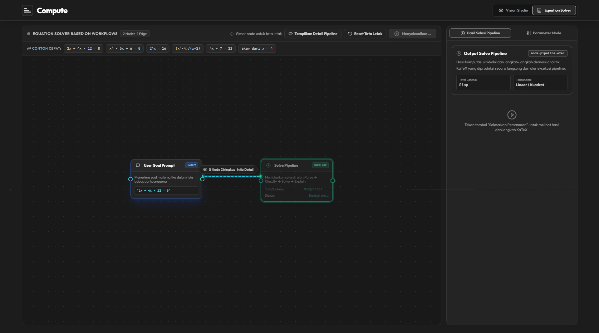

# ComputeAI

ComputeAI adalah platform web yang menggabungkan pengukuran objek berbasis Computer Vision dan penyelesaian soal matematika berbasis AI Workflow, dengan setiap hasil yang ditampilkan disertai rumus dan langkah perhitungannya secara transparan.

---

## Preview

**Vision Studio — Deteksi & Pengukuran Objek**

**Equation Solver — Penyelesaian Persamaan berbasis AI Workflow**

---

## Cara Pakai

**Mengukur/menghitung objek:**
1. Buka tab "Vision Studio & Formula"
2. Upload foto atau aktifkan Live Cam, sertakan objek referensi (koin) di frame yang sama
3. Sistem otomatis mendeteksi objek utama dan menampilkan ukurannya
4. Cek panel transparansi untuk melihat rumus perhitungannya

**Menyelesaikan soal matematika:**
1. Buka tab "Equation Solver"
2. Ketik soal (mis. `2x + 4x - 12 = 0`) atau pilih dari "Contoh Cepat"
3. Klik "Selesaikan Persamaan"
4. Lihat jawaban beserta langkah-langkah penyelesaiannya
